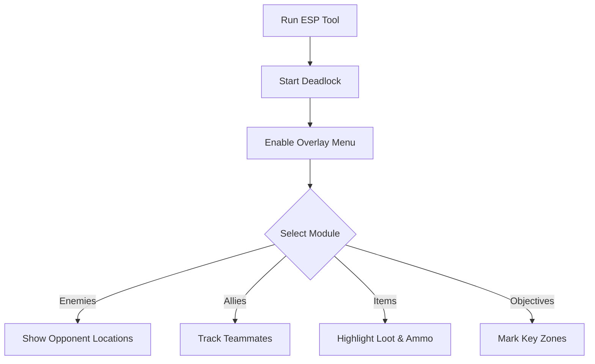

# Deadlock ESP 👁️

The **Deadlock ESP Overlay Software** gives players total situational awareness by displaying **enemy positions, loot, allies, and objectives** directly on screen. With customizable visuals and hotkey toggles, it helps you **plan strategies, avoid ambushes, and practice tactical control** in training and private sessions.

[](#)
[](#)
[](#)
[](#)

---

## 📝 Overview

In Deadlock, awareness is survival. The chaotic pace, vertical arenas, and unpredictable engagements can overwhelm even skilled players. ESP (Extra Sensory Perception) overlays reveal what’s hidden—**highlighting threats, loot, and key map zones**—so you can focus on strategy and execution.

\[!IMPORTANT]
This tool is intended for **offline and private practice**. It does not alter core game files.

---

## ⭐ Features

* **Enemy ESP** – Highlight enemy players with health and distance indicators.
* **Ally ESP** – Track teammates for better coordination.
* **Item ESP** – Display weapons, ammo, and power-ups on the map.
* **Objective Markers** – Show capture zones, spawn points, or stashes.
* **Custom Visuals** – Choose colors, transparency, and label sizes.
* **Hotkey Toggles** – Instantly enable or disable overlay modules.

---

## 🖥 Compatibility

| Platform           | Supported | Notes                      |
| ------------------ | --------- | -------------------------- |
| Windows 10/11      | ✅         | Full support               |
| Steam              | ✅         | Stable overlay integration |
| Linux (Proton)     | ⚠️        | Limited support            |
| Consoles (Xbox/PS) | ❌         | Not supported              |

\[!NOTE]
Accessibility: ESP overlays support customizable font sizes, color codes, and opacity for reduced screen clutter.

---

## ⚡ Setup Guide

1. **Download** the Deadlock ESP package.
2. Extract files into your Deadlock root folder.
3. Run `DeadlockESP.exe` as administrator.
4. Launch Deadlock and press `INSERT` to enable the overlay.
5. Customize modules in the menu or edit `config.ini`.

```ini
[esp]
enemy=red
ally=green
items=yellow
objectives=cyan
show_distance=true
```

---

## 🔄 ESP Workflow



---

## ❓ FAQ

**Q: Does ESP reduce FPS?**
A: Minimal impact—optimized for smooth high-FPS performance.

**Q: Can I customize the visuals?**
A: Yes, colors, labels, and transparency are all configurable.

**Q: Does it touch save files?**
A: No, ESP runs only in memory.

**Q: Can I toggle modules mid-game?**
A: Yes, via hotkeys or the overlay menu.

**Q: Is this safe for online matches?**
A: It is designed strictly for **offline or private sessions**.

---

## 🚀 Final Thoughts

The **Deadlock ESP Overlay Software** enhances **map awareness, item tracking, and team coordination**. With fully customizable visuals and lightweight performance, it’s the ideal tool for practicing and mastering Deadlock’s fast-paced arenas.

---


